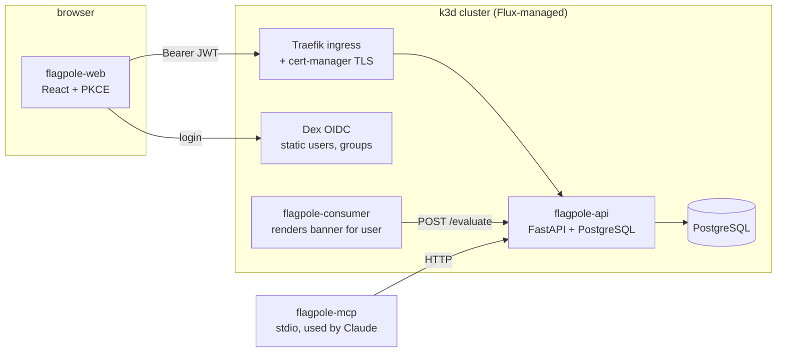

# Architecture (imported into CLAUDE.md)

Flagpole is a feature-flag service: **flags** have per-**environment** state (`dev`, `prod`: enabled + rollout percent) and are **evaluated** deterministically per user. Three services, one custom MCP server, one local k3d cluster managed by Flux.

- **Auth**: Dex issues JWTs; `groups` claim → role `operator` (group `operators`) or `viewer`. One FastAPI dependency enforces it.
- **Evaluation**: env disabled → `false`; else `sha256("{key}:{user_id}") % 100 < rollout_percent`.
- **Environments** appear three times on purpose: in the data model (`flag_environments.env`), in Kustomize overlays (`deploy/overlays/{dev,prod}`), and in Flux (`Kustomization/flagpole-dev`, `flagpole-prod`).
- **Delivery**: GitHub Actions builds `ghcr.io/randaguiac20/flagpole-*` images with semver tags → Renovate opens a PR bumping the tag in `deploy/` → merge → Flux reconciles. Secrets are SOPS+age encrypted in git and decrypted by Flux.
